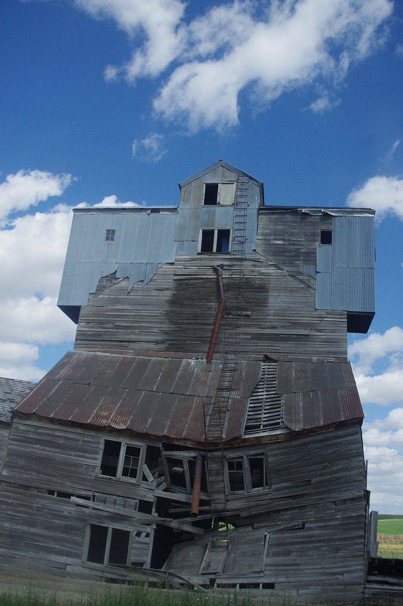
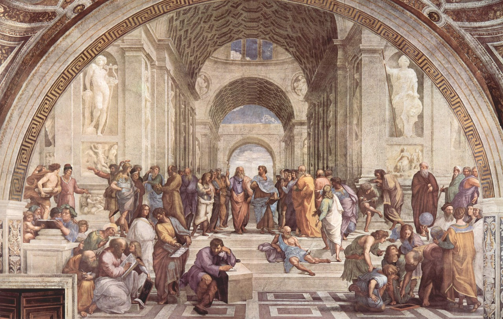
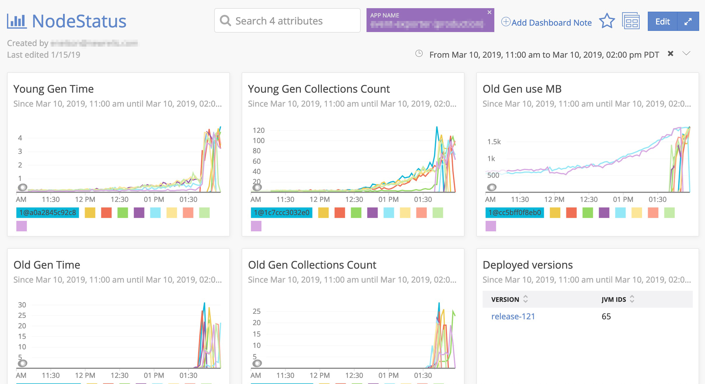
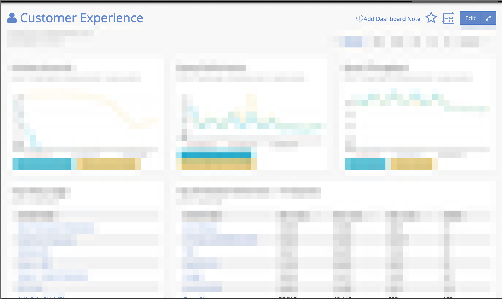
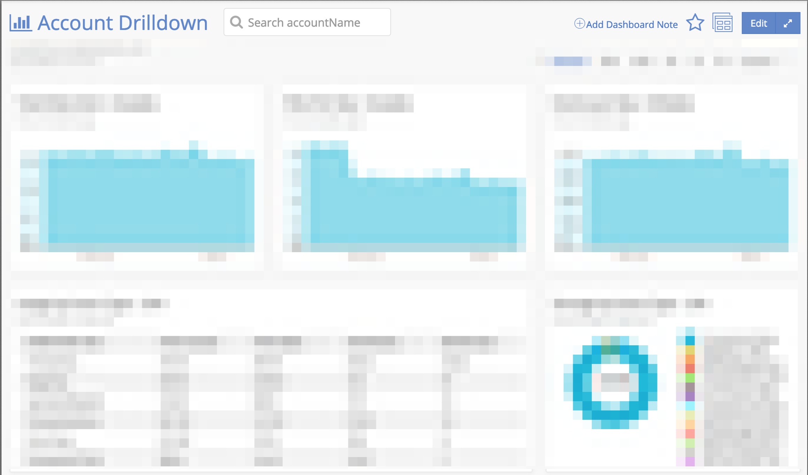

theme:Ostrich-Salmon
footer: @amylouboyle
build-lists: true

# A DevOps Practitioners Guide

^ I'm a Lead software Engineer at New Relic working on the Core Data Platform, my team does real-time stream processing on the large amount of data my company ingests. 

---

## Every minute New Relic handles:

40M+ HTTP requests

1.8B+ new data points

1000T+ events queried

^ To give a little context as to where I'm coming from, if you're not familiar with New Relic, we're a monitoring company. We're fully SaaS and multi-tenant.

^ As a platform team, we aren't tied to a particular product, but support other product teams by providing a foundation to store and query customer telemetry data. I've been at New Relic for almost 4 years. I'm coming from a development background, previous to working on my current team at New Relic, I had only released software.

---

## Lead development teams?

___

## Are developers?

___

## Are on-call?

___
    
# **Ownership**

^ At the core of doing devOps well is fostering a sense of ownership. Teams own the whole lifecycle of their software, and suffer the joys and relish the consequences of what they produce. Development teams _want_ to take responsibility for what their application is doing in the wild because they have a sense of ownership end to end in the system. Ownership of one's work increases the team productivity and morale and makes for more reliable software.

___

# Ownership

* Owning software architecture and project work
* Owning observability
* Owning the deployment

^ I've divided the talk into three main themes. These really they aren't clean distinctions and contain a ton of overlap. It's kinda the point in fact, that we're blurring the lines between writing and deploying software.  However, I've hopefully grouped concepts in a way to make discussion a little more clear. I'll also point out that I'm barely going to be able to scratch the surface with just 30 minutes for such a broad topic, but hopefully

___

# **Owning software architecture and project work**

<!--  -->

<!--  -->

<!--  -->
^ Software teams produce better software when they have some control over what they are building. They should design their parts of the system and evolve it as they grow

^ We have an architecture team that is in charge of Platform/company-wide software architecture. Teams are in charge of building their piece of the system. They all have an architect to work with, who will be available as a resource and to ensure that the system as a whole is put together well.

^ We frequently have design meetings as a team in advance of starting project. Everyone on the team get a chance to weight in and participate. This is great for multiple reasons. One, engineer morale and engagement. Everyone on the team gets to feel a greater sense of ownership and accomplishment when they get to shape the work. Two folks from different backgrounds and different levels in their careers bring different perspectives to the table. A more junior engineer may ask a seemlying "basic" question that causes you to question your assumptions. Three is that it's part of leveling up the more junior members of the team. They get to see the thought process that goes into developing software architecture (including all the bad ideas and wrong directions), instead of just having it handed down already "figured out".

<!-- ^ Longer term planning is owned by the team tech lead and architect -->

<!-- ^ Specific example Metric-aggregators: came up with plan architect asked questions and we refined the plan. -->
<!-- https://pixabay.com/photos/blueprint-ruler-architecture-964629/ -->
<!-- https://pixabay.com/photos/building-construction-site-cranes-768815/ -->
<!-- https://pixabay.com/photos/shipyard-project-crane-construction-2458150/ -->
<!-- https://pixabay.com/photos/architect-people-plan-construction-3979490/ -->

---

# Designing for resiliency

^ At New Relic we care very much about reliability. We're not a "move fast and break things company", more of a "swiftly and safely". When software teams are on-call they have a very tangible stake in the resiliency of their software. Teams know what the toil feels like and don't want to waste their time on it. 

^ This can provide a negative feedback loop.  It's like your body, when you're sick...

___

^ or injured you need to slow down and fix yourself. SOP can act like a car crash...

___

^ ... like if a critical DB goes down. So we try to mitigate these things, like putting on a...

___

^ ... seat belt on by setting up data base replicas, and having failovers. 

<!-- ^ Don't always get this right. When you're the same people dealing with your mistakes in the wild you can learn faster.... -->

^ Ascribing to DevOps shortens this feedback loop, as the same team experiencing the ops pain has all the context of how the application was built and what was changed recently.

<!-- https://pixabay.com/photos/boo-swindon-town-football-pain-2399974/ -->

^ Of course, it's possible to get into a downward spiral and be stuck in fire-fighting mode. It's easier to deal with problematic code/services before they become a total tire fire.

---

# Teams deal with their own cruft and are empowered to fix it.

^ Velocity through reduced time spent fire-fighting
^ Upgraded Hour TS snapshot mechanism

^ We own a service which would snapshot snapshot state for recovery in failure scenarios. While the way this was implemented worked great at the time, as scale increased it was causing pages and a significant amount of the on-call engineers time. So we moved back feature work on our road map to immediately address the issue. We refactored the service to be more robust and more closely match other architecture in our system which snapshots state.

<!-- https://pixabay.com/photos/grain-elevator-decrepit-farm-880108/ -->

---

Maintainability is part of velocity

^ Management prioritizes reliability and understands that Maintainability is part of Velocity. Software that is well maintained is easier to extend.
^ Refactored Transformation service to use FS before extending it (maintainability)
^ _Most_ software was the right thing at the time

<!-- https://pixabay.com/photos/model-car-ferrari-model-mechanic-2099498/ -->

---

# Autonomy & collaboration

^ Teams work better and have higher morale when they can make their own decisions about how to do their work

^ When you have autonomy it does mean that you need to make an intentional effort to avoid the siloing and duplication of engineering effort

---

# Autonomy

<!--  -->

<!--  -->

^ Additionally, they often have better information about what they can do to serve broad goals than central planners
^ Know which tools to use, and that are suited to the teams skills

^ Team autonomy is huge at New Relic. As I've already mentioned teams own the design and implementation of their software, and this also includes the tools they use. At least within reason. There are some rules you need to follow, like you must monitor your software with New Relic, and if you want to introduce new or obscure technologies you'll need to consult with the architecture team first. We have a set of architecture notes that include a bunch of "musts" and "shoulds". Such as ..... If you want a violate a "must" you'll need to take your case to the architecture team. But, largely New Relic follows the ethos of allowing engineers to build how they know best (wordsmith).
^ This includes architecture, but also process, like how the deal does agile
^ Avoid being blocked by other teams. Keeps Projects small (sprints? Part of the team autonomy is choosing how to use agile practices). Work around or implement things yourself.

<!-- https://pixabay.com/photos/art-school-of-athens-rapha%C3%ABl-1143741/ -->
<!-- https://pixabay.com/photos/application-business-collaboration-3426397/ -->

^ Danger is duplicated effort, solving same problem multiple times across org. Not only duplicated, but done slightly differently everywhere. Each problem is rife with unnecessarily different details.
^ Technology choices that aren't maintainable outside that one expert on the team, and don't make sense for the org at large

---

# Collaboration

^ Communities of practice
^ The commons : we get this right, sometimes. We've standardized on kafka and have some well-maintained libraries associated with our usage patterns around it. However, there are other libraries that are less well maintained and have no clear owner. This can cause issues when bug fixes need to be made, or when there is disagreement about the direction of where the code should go. I would try to avoid this state of having owner-less software.

^ example
<!-- https://pixabay.com/photos/business-cargo-containers-crate-1845350/ -->
<!-- https://commons.wikimedia.org/wiki/File:Rowing_Eights_Collegiate.png -->

---

# Collaboration

<!--  -->

^ For infrastructure which all teams will need you should have self-serve supported resources and libraries. Encourage most teams to use these things by making their jobs easier. For example New Relic has a Database team that will run a certain limited set of database types for you and manage the instances and replicas. Teams still own the schema and data.

<!-- https://pixabay.com/illustrations/monitor-binary-binary-system-1307227/ -->

---

Work on one thing at a time

^ Have one active project at a time. It might be feature work, or scaling work or technical debt refactoring work. Everyone is working on the same project, keeps the time to delivery shorter so you can start getting feedback on things sooner and realizing the value sooner. 

^ Additionally it keeps the whole team in the same context which helps for collaborating on solutions and keeping the on-call up to date with recent changes. Team members avoid costly context switching trying to keep up with what the other folks on the team are working on for code reviews. It also avoid the knowledge silos you can get one each person has their own project. I've found it also tend to be more enjoyable. No one person gets "stuck" working on something, or no one person get to work on the exciting or high-profile project. The team is in it together.

^ There are always small timely tasks that come up and need to be done. We have a rotating role on the team we call ...

<!-- https://pixabay.com/illustrations/woman-girl-balloon-thought-bubble-1172718/ -->
<!-- https://pixabay.com/photos/upset-overwhelmed-stress-tired-2681502/ -->

---

Rotating hero handles distractions

^the "hero" who, for a week at a time will work on time-sensitive issues, or maintenance issues to small to warrant a project. This person will also be responsible for fielding support questions. This is typically the same week as on-call. So there is one person on the team who is interruptible, allowing all others on the team to be able to focus on project work.

^ Downsides to single project work? What if there is not enough to parallelize on?
<!-- https://pixabay.com/photos/woman-super-hero-beautiful-3373173/ -->
___

# **Owning observability**

^ Of course sine we're responsible for the whole lifecycle of our software, we are responsible for making sure that we know how it's running, and that we know how we know it's running. That is, we understand our monitoring tools and are confident with the level of coverage we have. We know where to look to determine the health of the system, we know how to dive in and troubleshoot, and have alerts set up to automatically notify us when things go wrong.

^ Observability = thinking about monitoring holistically (I read a definition of observability that said it was monitoring + testing, well ok then)

^ Also means understanding you can't have perfect visibility, and being aware of your limitations. Particularly true in high throughput and distributed systems

---

# Motivations for monitoring

* Development
* Customer compassion
* Business intelligence

^ May overlap, in fact it can be good if they do

---

# Development

* Feature visibility
* Troubleshooting
* Capacity

^ This is probably the largest category
^ Did the thing I released work as expected? Did this refactor in fact not change anything?
^ What is happening with data flows/state? Errors.
^ Throughput and resource usage

---

---

# Customer compassion

* Service quality
* SLAs

^ latency
^ PSLIs 

---

# Business intelligence

* Who is using your product
* ROI

^ Which customers are the largest users of certain services?
^ decorate/join with ARR

---

# Things to monitor:

* System/application boundaries
* Decision points
* Bottlenecks
* Primary indicators of service quality

^ Distributed tracing/Kafka passport/PSLIs?

^ Decorate with useful things, metadata, dollars

^ Decision points: filter matching stats

^ Bottle necks: e.g queues, CPU utilization

^ Primary indicators for us: Data latency:lag (streaming systems key indicator; important because time to glass)

---

Keep monitoring asynchronous

^ e.g. MEE. Monitoring should be unobtrusive. Strive to keep it's impact small, do as little as possible in the hot path that will add to the latency experienced by customers. Extra processing and sends should happen in a background thread.
^ We make heavy use of APIs and custom instrumentation and keep this in mind.
^ Of course the New Relic agents are built upon this principle as well. I used to work on the Python Agent team, and doing the least amount of work possible while in the application code path was a foremost principle

---

# [fit] MELT

Metrics, Events, Logs, Traces

^ Use the right data type for the thing you're monitoring

___

# Metrics

* Pre-aggregated
* Lightweight

^ Metrics are pre-aggregated pieces of data that will give you measures like throughput, average, min, max. Good lightweight monitoring for the the hot-path in a high throughput system. You can decorate metrics with metadata to make them more useful, use them as dimensions you can group the metrics by. Need to be careful of cardinality explosions that can cause performance and storage issues.

---

# Events
 
* Point in time/sample
* Detailed

^ Events are pieces of monitoring recording a particular occurrence of something, a single timestamp with a bunch of associated data, typically key-value pairs. If these get to be high volume, they should be sampled. For example, we use events to record some details about start up, for error or for reporting sampled state such as JVM info or info on queues.

---

# Logs

---

# Traces

* Traces path across services

^ Trace the path of a request as it travels across a complex system, connecting the pieces

---

# [fit] MELT

Metrics, Events, Logs, Traces

___

# Monitoring-first mentality

^ Monitoring from first commit. If we're spinning up a new service we should be getting the basic health metrics we build into every service from our first push. Add a piece of functionality, ask your self, how do I know this is working?
^ TDD comparision?

---

Shared code? templates? Have your monitoring built into that.

^ Nos templates, Monitoring code in kafka-clients, MEE

^ Advantages:
^     1. Monitoring is build in and already present
^     2. Reduced effort/ code duplication
^     3. Shared expertise of how to monitor the thing
^     4. Common monitoring between teams for better shared understanding

---

# **Owning the deployment**

^ We deploy our changes in frequent small pieces
^ you should be the first one to know something is wrong with your system
^ Of course one of the great advantages to DevOps is that shortened troubleshooting loop and reduced MTTR. The team has all the context for debugging issues with their software plus access to and is knowledgeable about the system monitoring.

---

Playing nicely with others

^ GK Lets you know if someone else is having a bad time.
^ Used to block you when any dependencies were also going at the same time, but this got out of hand.

^ No matter how much you plan and test, you can never remove fault from your system...

<!-- https://pixabay.com/photos/puppy-labrador-retriever-play-dog-4016220/ -->

---

# [fit] Alerting

unexpected problems that you need a human to fix

<!--  -->
<!--  -->

^ Set this up for human time scales
^ Automate away anything expected/with a clear runbook
^ Mercilessly squish false positives : baselines example; Partitioner errors
^ Every week we count the number of pages and how many were actionable
^ If you're missing a signal you have the power to add it
^ Every week we review all the off hours pages for the week

^ A few months ago we added monitoring for sigkills.. mention that sigkills are related to auto-deploys.

<!-- ^ Ahead of the curve on alerting: partition ownership, sigkills, auto-commit failure -->
 
<!-- https://pixabay.com/photos/alarm-light-siren-emergency-959592/ -->
<!-- https://pixabay.com/photos/fire-truck-volunteer-firefighter-4012105/ -->

---

Incident command

^ When we're experiencing an SLI violation we go the the #emergency-room to coordinate with other engineering teams and support
^ We have a whole central process we've put a lot of thought into. Deserves a whole talk, in fact some colleagues have given one titled...

<!-- https://pixabay.com/photos/firefighters-fire-flames-outside-115800/ -->

---

"Better Incident Management to Reduce MTTR"

___

blameless culture fosters collaboration

^ Blameless incidents: If there is a fear of making mistakes and getting punished folks won't make critical decisions
^ Blame incentivizes excuses and avoiding the problem for folks who may have the power to fix it
^ Blameless retros : focus on process

---

Don't Repeat Incidents

^ History?
^ Highest priority work
^ DRI and dealing with cruft are two parts of being empowered to fix your stuff and must be a part of DevOps and software ownership. You can't expect teams to own this stuff if they aren't allowed to fix it. If a team doesn't feel like they can maintain their service they don't really own it.

<!-- https://pixabay.com/vectors/circle-icons-dragon-ring-snake-1295218/ -->

<!--  
[.autoscale: true]

## If you remember nothing else....

* Treat maintainability as reliability
* Build monitoring into your system
* Mercilessly squish false positive alerts
* Don't repeat incidents
* Autonomy requires effective collaboration
-->
---

# **Ownership**

---

# **Owning software architecture and project work**

* Treat maintainability as reliability
* Autonomy requires effective collaboration

---

# **Owning observability**

* Build monitoring into your system
* Share monitoring between teams

---

# **Owning the deployment**

* Mercilessly squish false positive alerts
* Don't repeat incidents

---
[.autoscale: true]

This document and the information herein (including any information that may be incorporated by reference) is provided for informational purposes only and should not be construed as an offer, commitment, promise or obligation on behalf of New Relic, Inc. (“New Relic”) to sell securities or deliver any product, material, code, functionality, or other feature. Any information provided hereby is proprietary to New Relic and may not be replicated or disclosed without New Relic’s express written permission.

Such information may contain forward-looking statements within the meaning of federal securities laws. Any statement that is not a historical fact or refers to expectations, projections, future plans, objectives, estimates, goals, or other characterizations of future events is a forward-looking statement. These forward-looking statements can often be identified as such because the context of the statement will include words such as “believes,” “anticipates,” “expects” or words of similar import.

Actual results may differ materially from those expressed in these forward-looking statements, which speak only as of the date hereof, and are subject to change at any time without notice. Existing and prospective investors, customers and other third parties transacting business with New Relic are cautioned not to place undue reliance on this forward-looking information. The achievement or success of the matters covered by such forward-looking statements are based on New Relic’s current assumptions, expectations, and beliefs and are subject to substantial risks, uncertainties, assumptions, and changes in circumstances that may cause the actual results, performance, or achievements to differ materially from those expressed or implied in any forward-looking statement. Further information on factors that could affect such forward-looking statements is included in the filings we make with the SEC from time to time. Copies of these documents may be obtained by visiting New Relic’s Investor Relations website at ir.newrelic.com or the SEC’s website at www.sec.gov. 

New Relic assumes no obligation and does not intend to update these forward-looking statements, except as required by law. New Relic makes no warranties, expressed or implied, in this document or otherwise, with respect to the information provided.
